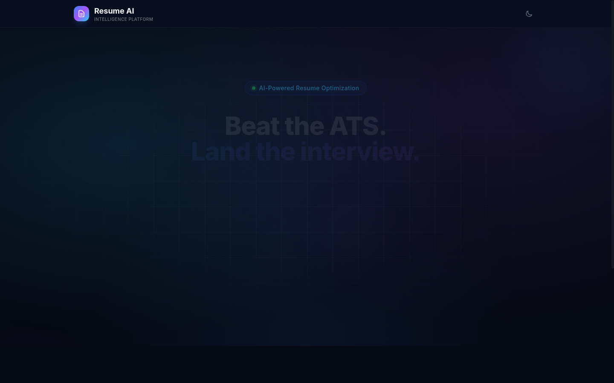
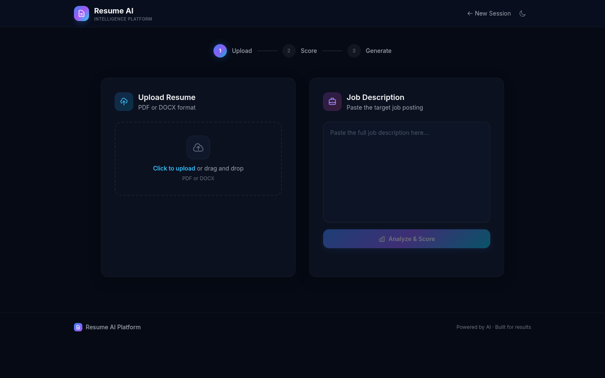
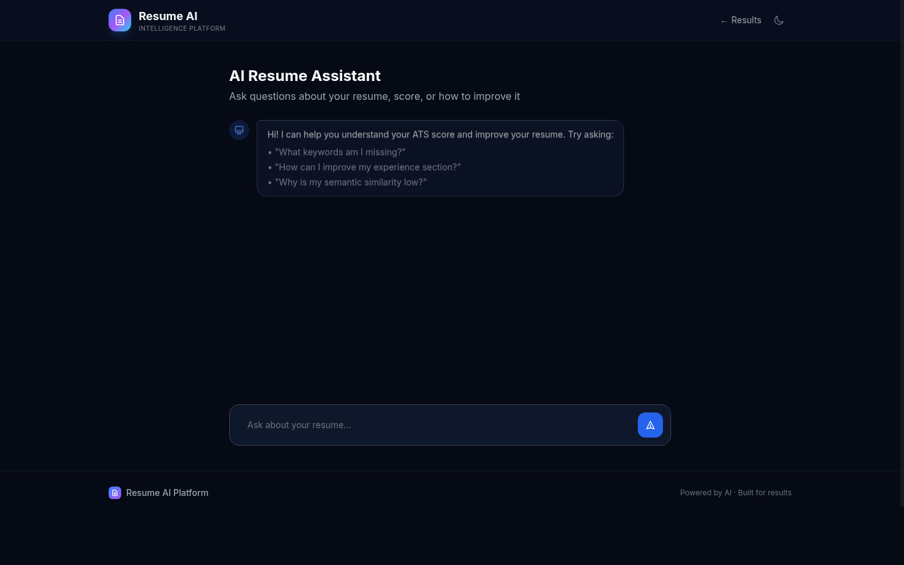

<div align="center">

# Resume AI Platform

**Multi-Agent AI Resume Intelligence Platform**

An AI-powered platform that analyzes resumes against job descriptions, scores ATS compatibility, generates tailored resumes, and provides conversational feedback — all through a multi-agent pipeline orchestrated by LangGraph.

[](https://python.org)
[](https://fastapi.tiangolo.com)
[](https://htmx.org)
[](https://langchain-ai.github.io/langgraph/)
[](LICENSE)

</div>

---

## Table of Contents

- [Introduction](#introduction)
- [How It Works](#how-it-works)
- [Screenshots](#screenshots)
- [Features](#features)
- [Tech Stack](#tech-stack)
- [Architecture](#architecture)
- [Getting Started](#getting-started)
- [Usage](#usage)
- [API Endpoints](#api-endpoints)
- [Project Structure](#project-structure)
- [Testing](#testing)
- [Environment Variables](#environment-variables)
- [Docker Deployment](#docker-deployment)
- [Contributing](#contributing)
- [License](#license)

---

## Introduction

Resume AI Platform is a **production-grade, multi-agent system** that treats resume optimization as a structured engineering problem — not just a chatbot wrapper over an LLM.

It combines **document parsing**, **NLP-based entity extraction**, **ATS scoring**, **LLM-powered resume generation**, and **conversational AI** into a cohesive pipeline. Upload your resume, paste a job description, and get a detailed ATS compatibility report with a tailored, downloadable resume — all in one session.

### Why This Exists

- Most resume tools give you a score with no actionable output
- LLM wrappers hallucinate resume content without grounding it in your actual experience
- No tool connects the full loop: parse → analyze → score → generate → explain

This platform does all five.

---

## How It Works

```
┌─────────────────────────────────────────────────────────────────┐
│                        User Interface                           │
│  Upload Resume (PDF/DOCX) → Paste Job Description → Get Results │
└──────────────────────────┬──────────────────────────────────────┘
                           │
                           ▼
┌─────────────────────────────────────────────────────────────────┐
│                      LangGraph Pipeline                         │
│                                                                 │
│  ┌──────────────┐    ┌──────────────┐    ┌──────────────┐      │
│  │   Document    │───▶│   Resume     │───▶│      JD      │      │
│  │    Parser     │    │  Normalizer  │    │   Analyzer   │      │
│  └──────────────┘    └──────────────┘    └──────────────┘      │
│                            │                    │               │
│                            ▼                    ▼               │
│                      ┌──────────────────────────┐              │
│                      │      ATS Scorer          │              │
│                      │  (Resume + JD → Score)   │              │
│                      └──────────┬───────────────┘              │
│                                 ▼                              │
│                      ┌──────────────────────────┐              │
│                      │    Resume Generator      │              │
│                      │  (Tailored DOCX + PDF)   │              │
│                      └──────────────────────────┘              │
└─────────────────────────────────────────────────────────────────┘
                           │
                           ▼
┌─────────────────────────────────────────────────────────────────┐
│                     Conversational Agent                        │
│  Chat with AI about your resume, score, and improvement tips    │
└─────────────────────────────────────────────────────────────────┘
```

### Pipeline Steps

1. **Document Parser** — Extracts raw text blocks from PDF/DOCX using `pdfplumber` and `python-docx`
2. **Resume Normalizer** — Uses NLP (spaCy) and LLM to structure raw text into a normalized JSON schema (name, experience, education, skills, etc.)
3. **Job Description Analyzer** — Extracts required skills, qualifications, and keywords from the JD
4. **ATS Scorer** — Compares the resume against the JD using keyword matching (RapidFuzz), semantic similarity (NLTK), and LLM analysis to produce a detailed score report with grade, gaps, and recommendations
5. **Resume Generator** — Creates a tailored, ATS-optimized resume in both DOCX and PDF formats using different strategies (Conservative, Aggressive, Creative)
6. **Conversational Agent** — Chat interface grounded in your actual resume data, ATS report, and JD analysis — no hallucination

---

## Screenshots

### Landing Page


### Session Dashboard


### Chat Interface


---

## Features

- **Multi-format Document Parsing** — Supports PDF and DOCX resume uploads
- **NLP-Powered Entity Extraction** — Uses spaCy for named entity recognition, date parsing, and skill extraction
- **ATS Compatibility Scoring** — Keyword gap analysis, formatting checks, section completeness scoring
- **LLM-Driven Resume Generation** — Three tailoring strategies:
  - `CONSERVATIVE` — Minimal changes, preserves original tone
  - `AGGRESSIVE` — Rewrites bullet points with stronger action verbs and quantified impact
  - `CREATIVE` — Restructures content for maximum ATS optimization
- **Dual Output Format** — Download as DOCX or PDF
- **Grounded Chat** — Conversational AI that references your actual resume and score data
- **Session Management** — Full session lifecycle with persistent storage
- **Real-time UI** — HTMX-powered SPA-like experience without JavaScript frameworks
- **Configurable LLM Backend** — Switch between Groq (Llama 3.3) and Google Gemini

---

## Tech Stack

| Layer | Technology |
|-------|-----------|
| **Backend** | Python 3.11+, FastAPI, Uvicorn |
| **Frontend** | HTMX, Tailwind CSS, Jinja2 |
| **Database** | SQLite (dev) / PostgreSQL (prod) via SQLAlchemy (async) |
| **Orchestration** | LangGraph (stateful DAG pipeline) |
| **LLM Providers** | Groq (Llama 3.3 70B), Google Gemini 2.0 Flash |
| **NLP** | spaCy, NLTK, RapidFuzz, dateparser |
| **Document Processing** | pdfplumber, python-docx, fpdf2 |
| **Migrations** | Alembic |
| **Testing** | pytest, pytest-asyncio, httpx |
| **Linting** | Ruff |
| **Containerization** | Docker, Docker Compose |

---

## Architecture

The system follows a **multi-agent pipeline pattern** where each agent is a specialized, single-responsibility module:

```
app/
├── agents/              # Domain-specific AI agents
│   ├── document_parser.py    # PDF/DOCX text extraction
│   ├── resume_normalizer.py  # NLP + LLM structuring
│   ├── jd_analyzer.py        # Job description analysis
│   ├── ats_scorer.py         # ATS compatibility scoring
│   ├── resume_generator.py   # Tailored resume creation
│   └── conversational.py     # Chat agent
├── orchestrator/        # LangGraph pipeline
│   ├── graph.py              # DAG definition
│   ├── nodes.py              # Pipeline node functions
│   └── edges.py              # Conditional routing
├── api/                 # REST API routes
├── web/                 # HTMX web UI routes
├── db/                  # SQLAlchemy models + repository
├── llm/                 # LLM provider abstraction
├── schemas/             # Pydantic data models
└── storage/             # File storage abstraction
```

---

## Getting Started

### Prerequisites

- Python 3.11+
- pip or a Python package manager
- A Groq API key or Google Gemini API key

### Installation

```bash
# Clone the repository
git clone https://github.com/yourusername/resume-ai-platform.git
cd resume-ai-platform

# Create a virtual environment
python -m venv venv
source venv/bin/activate  # Linux/macOS
# venv\Scripts\activate   # Windows

# Install dependencies
pip install -e ".[dev]"

# Download spaCy model
python -m spacy download en_core_web_sm

# Copy environment template
cp .env.example .env
# Edit .env with your API keys

# Run the application
uvicorn app.main:app --reload --port 8000
```

Open [http://localhost:8000](http://localhost:8000) in your browser.

---

## Usage

1. **Create a Session** — Click "Start New Session" on the landing page
2. **Upload Your Resume** — Drag and drop or select a PDF/DOCX file
3. **Paste Job Description** — Copy the target job posting into the text area
4. **Run ATS Analysis** — Click "Score Resume" to get your compatibility report
5. **Generate Tailored Resume** — Choose a strategy (Conservative/Aggressive/Creative) and download
6. **Chat with AI** — Ask questions about your score, gaps, or improvement suggestions

---

## API Endpoints

| Method | Endpoint | Description |
|--------|----------|-------------|
| `GET` | `/health` | Health check |
| `POST` | `/api/sessions` | Create a new session |
| `GET` | `/api/sessions/{id}` | Get session details |
| `POST` | `/api/documents` | Upload a document |
| `POST` | `/api/scoring` | Score resume against JD |
| `POST` | `/api/generation` | Generate tailored resume |
| `POST` | `/api/chat` | Send chat message |
| `GET` | `/` | Landing page (web UI) |
| `GET` | `/session/{id}` | Session dashboard (web UI) |
| `GET` | `/session/{id}/results` | Results page (web UI) |
| `GET` | `/session/{id}/chat` | Chat page (web UI) |

---

## Project Structure

```
resume-ai-platform/
├── alembic/                    # Database migrations
├── app/
│   ├── agents/                 # AI agent modules
│   ├── api/routes/             # REST API endpoints
│   ├── api/schemas/            # Request/response schemas
│   ├── db/                     # Database engine, models, repository
│   ├── llm/                    # LLM provider abstraction (Groq/Gemini)
│   ├── orchestrator/           # LangGraph pipeline
│   ├── schemas/                # Domain Pydantic models
│   ├── storage/                # File storage (local)
│   ├── utils/                  # NLP and scoring utilities
│   ├── web/                    # HTMX web routes
│   ├── config.py               # Settings management
│   ├── deps.py                 # Dependency injection
│   └── main.py                 # FastAPI application
├── docs/screenshots/           # UI screenshots
├── static/                     # CSS, JS assets
├── templates/                  # Jinja2 HTML templates
│   ├── partials/               # HTMX partial templates
│   ├── base.html
│   ├── index.html
│   ├── session.html
│   ├── results.html
│   └── chat.html
├── tests/                      # Test suite
├── uploads/                    # Uploaded files (gitignored)
├── Dockerfile
├── docker-compose.yml
├── pyproject.toml
├── alembic.ini
├── .env.example
└── .gitignore
```

---

## Testing

```bash
# Run all tests
pytest

# Run with verbose output
pytest -v

# Run specific test file
pytest tests/test_agent_ats_scorer.py

# Run with coverage
pytest --cov=app

# Lint
ruff check app/ tests/
```

The test suite covers:
- All 6 agents (document parser, normalizer, JD analyzer, ATS scorer, resume generator, conversational)
- API routes
- Web routes
- Repository layer
- NLP utilities
- Scoring utilities

---

## Environment Variables

| Variable | Default | Description |
|----------|---------|-------------|
| `LLM_PROVIDER` | `groq` | LLM backend: `groq` or `gemini` |
| `LLM_MODEL` | `llama-3.3-70b-versatile` | Model identifier |
| `GROQ_API_KEY` | — | Groq API key |
| `GEMINI_API_KEY` | — | Google Gemini API key |
| `DATABASE_URL` | `sqlite+aiosqlite:///./resume_ai.db` | Database connection string |
| `DB_PASSWORD` | — | PostgreSQL password (prod) |
| `STORAGE_PATH` | `./uploads` | File upload directory |
| `APP_ENV` | `development` | Environment (`development`/`production`) |
| `LOG_LEVEL` | `INFO` | Logging level |

---

## Docker Deployment

```bash
# Build and start all services
docker compose up --build

# Run in background
docker compose up -d

# View logs
docker compose logs -f app

# Stop
docker compose down
```

The compose stack includes:
- **app** — FastAPI application (port 8000)
- **db** — PostgreSQL 16 (port 5432)

---

## Contributing

1. Fork the repository
2. Create a feature branch (`git checkout -b feature/amazing-feature`)
3. Commit your changes (`git commit -m 'Add amazing feature'`)
4. Push to the branch (`git push origin feature/amazing-feature`)
5. Open a Pull Request

Please ensure:
- All tests pass (`pytest`)
- Code passes linting (`ruff check`)
- New features include tests

---

## License

This project is licensed under the MIT License — see the [LICENSE](LICENSE) file for details.

---

<div align="center">

**Built with FastAPI, HTMX, LangGraph, and LLMs**

</div>
